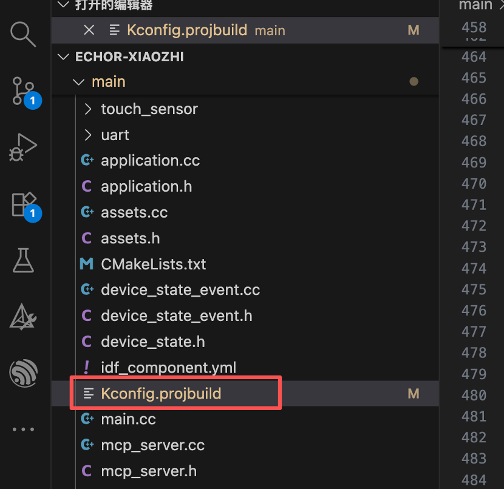
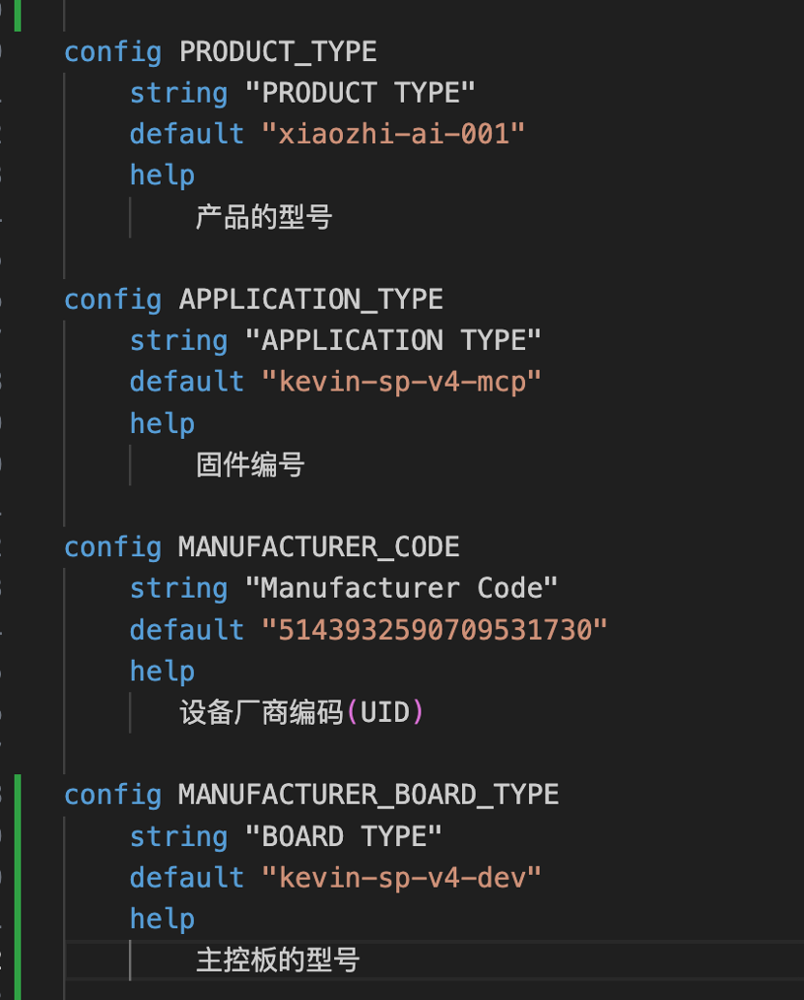
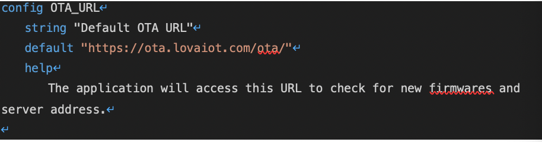

  
  <h1>拓云 tuoyun_esp32 项目</h1>

## 介绍

tuoyun_esp32 是北京拓云为了让原来接入 xiaozhi.me 改为接入拓云后台而基于原来 xiaozhi 的 esp32 的开源项目，

## 拓云 AI 介绍

拓云 AI IoT 平台为硬件厂商提供一站式大模型接入解决方案，通过开源 SDK 快速集成 DeepSeek、通义千问、豆包等主流大模型，让传统硬件瞬间具备 AI 能力。

### 核心特性

#### 🔌 全方位 AI IoT 解决方案

从硬件接入到用户运营，拓云提供完整的 AI IoT 生态链服务，让您的智能硬件产品快速获得 AI 能力。

#### 📱 微信小程序

用户友好的配网小程序，支持设备绑定、参数配置、模型选择等功能：

- 一键配网连接
- TTS 语音设置
- 大模型参数调优
- 角色智能体管理和配置

  
  
  

#### 👥 用户运营

为硬件厂商提供用户运营平台，支持增值服务包销售和用户生命周期管理：

- 增值服务包管理
- 用户行为分析
- 智能推荐系统

#### ⚡ 高性能

毫秒级响应，支持大规模并发，智能负载均衡，确保服务稳定可靠：

- 99.9% 服务可用性
- 毫秒级响应时间
- 弹性扩容

#### 🤖 多模型支持

支持 DeepSeek、千问、豆包等主流大模型，一键切换，满足不同业务需求：

- 主流大模型全覆盖
- 智能模型选择
- 成本优化建议

### 已实现功能

- 小程序蓝牙配网，小程序角色管理
- 离线语音唤醒
- MQTT+UDP 协议
- 电量显示与电源管理
- 支持多语言（中文、英文、日文）
- 小程序虚拟服务购买等
- ota 管理

## 硬件

因为服务端兼容了原来的协议，所以理论上所有原来的
硬件都能支持

### 接入说明

#### 1. 拓云 AI 厂商合作伙伴账户注册

为了接入拓云平台，需要先注册一个厂商账户，后续的产品管理、固件 OTA 管理等功能都在这个后台完成。

👉 [拓云厂商注册地址](https://agent.lovaiot.com/)

#### 2. 合作伙伴型号管理

拓云平台定义了三种基础物料型号，用于组成一个完整的 AI 硬件产品：

- **玩具型号**：产品的外观形态（如 AI 小熊、AI 机器人等）
- **控制板型号**：硬件控制板型号（如 ESP32-S3 开发板）
- **固件**：运行在控制板上的固件版本

##### 2.1 控制板添加

登录厂商后台，点击左侧的"型号管理" → "控制板型号" → "添加控制板"，填写控制板信息。

##### 2.2 玩具型号添加

点击左侧"玩具型号管理" → "添加玩具型号"，填写产品信息。

##### 2.3 固件添加

点击左侧"固件管理" → "添加固件"，在"适用产品"中选择上面添加的玩具型号。

#### 3. ESP32 固件修改

拓云服务端完全兼容小智协议，并在此基础上进行了功能更新和扩展。

##### 3.1 获取固件源码

从 [tuoyun-robot-esp32](https://github.com/tuoYunAI/tuoyun_esp32) 获取固件源码，或联系拓云官方人员获取。

##### 3.2 修改配置文件

在工程的 `Kconfig.projbuild` 文件中添加以下配置项(本工程已经有这些配置项，修改即可)：

- 产品型号
- 固件编号
- 主板型号
- 设备厂商（需要联系拓云官方人员获取）

##### 3.3 修改 OTA 地址

也可以在 `menuconfig` 中进行配置。

#### 4. 设备使用

重新烧录固件后，用户可以通过"拓云 AI"小程序完成以下操作：

1. **添加设备**：扫描上方二维码进入拓云 AI 小程序
2. **蓝牙配网**：通过蓝牙完成网络配置
3. **绑定智能体**：选择并绑定 AI 智能体角色

配置完成后即可开始使用 AI 对话功能。

## 关于项目

这是一个基于虾哥开源的 ESP32 项目的修改的项目，以 MIT 许可证发布，允许任何人免费使用，修改或用于商业用途。
